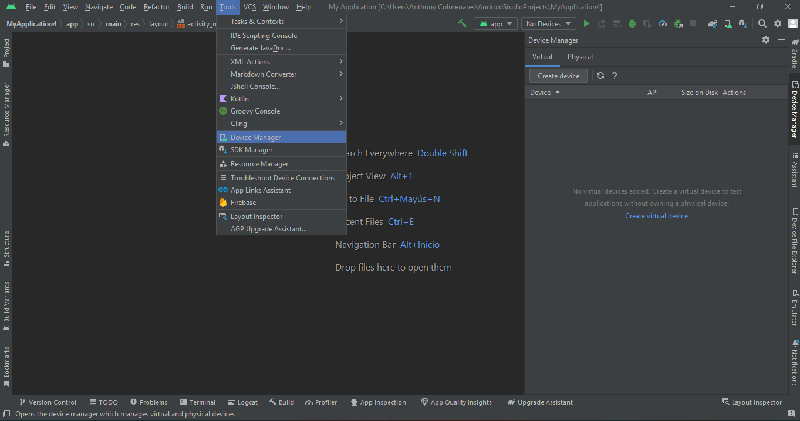
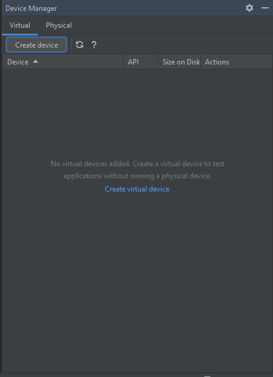
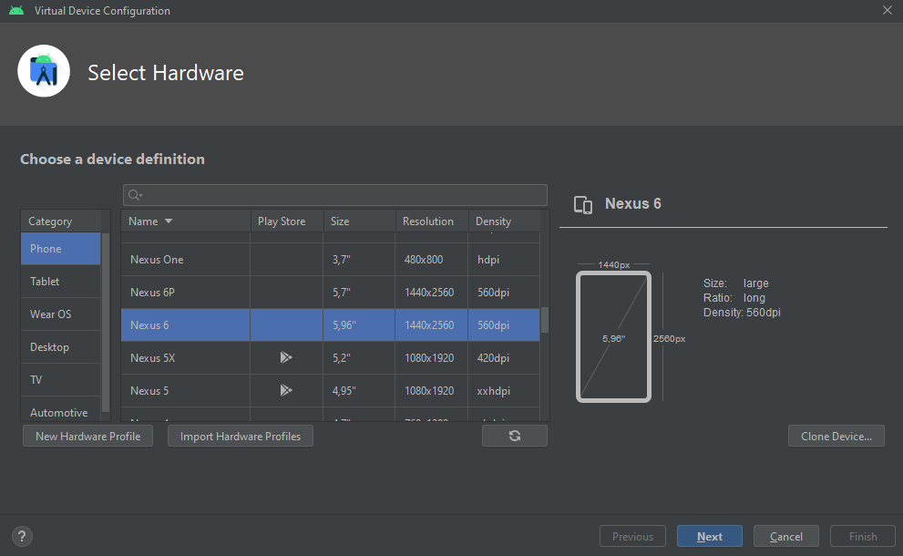
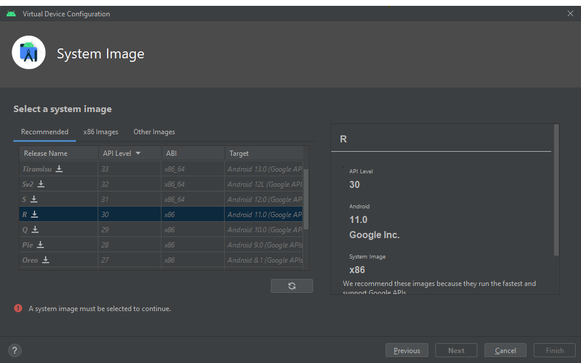
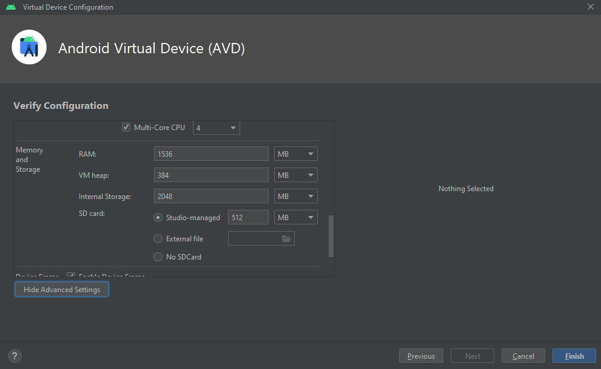
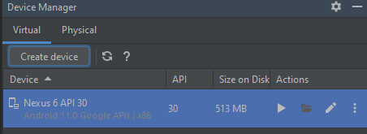

## Pasos para creacion de un nuevo dispositivo virtual en Android Studio

1. Abrir **Android Studio**
2. Seleccionar "**Device Manager**" en la barra de herramientas o en el menú "Tools"

  

3. Seleccionar "**Create Device**"

  

4. Seleccionar un dispositivo (teléfono o tableta)

  

5. Seleccionar una versión de Android

  

6. Personalizar la configuración del dispositivo virtual (RAM, almacenamiento interno, skin, etc.)

  

7. Hacer clic en "**Finish**"

8. Hacer clic en "**Play**" para iniciar el dispositivo virtual

  

## Glosario de funciones comunes de Android Studio

1. **Editor de código:** Es la función principal de Android Studio, que permite escribir y editar código fuente en lenguaje Java o Kotlin para la creación de aplicaciones para dispositivos Android.

2. **Debugger:** Permite depurar y solucionar problemas en el código fuente de una aplicación durante el proceso de desarrollo. Esta función también permite agregar puntos de interrupción y observar el estado de las variables y otros elementos durante la ejecución del código.

3. **AVD Manager:** Es un administrador de dispositivos virtuales que permite crear, editar y eliminar dispositivos virtuales para emular diferentes tipos de dispositivos Android.

4. **Layout Editor:** Permite diseñar y editar la interfaz de usuario de una aplicación de forma visual, utilizando herramientas de arrastrar y soltar para colocar elementos gráficos y de texto.

5. **Gradle Build System:** Es un sistema de compilación de código fuente que automatiza la creación de paquetes de aplicaciones y la generación de archivos de compilación en Android Studio.

6. **System File Explorer:** Permite acceder a los archivos y directorios del sistema operativo Android en un dispositivo físico o virtual.

7. **Profiler:** Permite analizar el rendimiento y la eficiencia de una aplicación, identificando posibles cuellos de botella y optimizando el uso de recursos del dispositivo.

8. **Android Asset Packaging Tool (AAPT):** Es una herramienta que se utiliza para compilar y empaquetar los recursos de una aplicación, como imágenes, archivos de audio y video, y otros elementos multimedia.

9. **Android Virtual Device (AVD):** Es un entorno virtual que emula un dispositivo Android completo para probar y depurar aplicaciones sin necesidad de un dispositivo físico.
